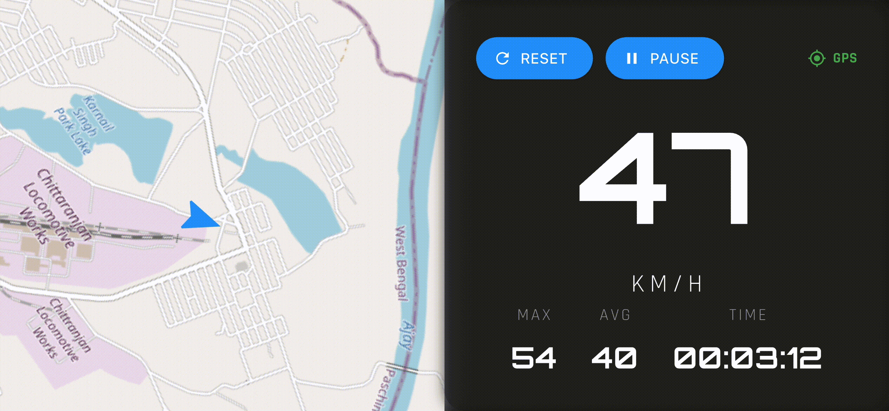

# Sedo

**Sedo** is an open-source motorcycle dashboard application built with Flutter for Android and iOS.

Designed specifically for riders, Sedo transforms a smartphone into a motorcycle-friendly dashboard featuring real-time GPS speed monitoring, navigation, ride statistics, and system-wide media controls in a clean, distraction-free interface.

Unlike traditional motorcycle infotainment systems, Sedo aims to provide essential riding information using only a smartphone, making advanced dashboard functionality accessible without expensive hardware.

The project is actively developed and tested in real-world riding conditions, with a focus on usability, reliability, and rider safety.

---

---

## Current Features

| Feature                | Status |
| ---------------------- | ------ |
| GPS Speedometer        | ✅      |
| Live Navigation Map    | ✅      |
| Ride Distance Tracking | ✅      |
| Average Speed Tracking | ✅      |
| Maximum Speed Tracking | ✅      |
| Ride Timer             | ✅      |
| Dark / Light Themes    | ✅      |
| Android Media Controls | ✅      |
| iOS Media Controls     | ✅      |
| Cross-Platform Support | ✅      |

## Key Features

### Real-Time Speedometer

GPS-based speed tracking optimized for motorcycle riding.

### Live Navigation Map

Rotating rider-focused map with smooth camera following and automatic zoom adjustments based on speed.

### Ride Statistics

Track:

* Current Speed
* Maximum Speed
* Average Speed
* Distance Travelled
* Ride Duration

### Universal Media Controls

Control media playback from supported music applications directly within Sedo.

### Rider-Focused Interface

* Large readable typography
* Landscape-first design
* Dark and light themes
* Optimized for phone mounts and motorcycle use

## Project Status

Sedo is currently in active development and has been tested on real motorcycle rides.

<pre>
#                                       Granthik Som ~ git version 2.50.1 (Apple Git-155)
 ##                                     -------------------------------------------------
  ###                                   Project: sedo (2 branches, 1 tag)
   ######              ###              HEAD: 0fb3926 (main, origin/main)
    #########        #######            Version: v0.1
      ###########  ######O##========-   Created: 5 months ago
       #####################            Languages:
         ##################                        ● Dart (89.1 %) ● CMake (3.2 %)
      ###############+++++                         ● Swift (2.7 %) ● Kotlin (2.6 %)
###################+++++++                         ● C++ (2.1 %) ● HTML (0.4 %)
        ##########+++++++               Authors: 99% Granthik Som 75
               ##+++++++                          1% Granthik 1
               ###+++                   Last change: a day ago
               #####                    URL: https://github.com/GranthikSom/sedo.git
               #######                  Commits: 76
               #########                Churn (15): pubspec.lock 6
                #######                             pubspec.yaml 6
                 #####                              …/pages/auth.dart 6

                                        Lines of code: 5145
                                        Size: 13.07 MiB (135 files)
</pre>

                                                                

## Roadmap

### Completed

* [x] GPS Speedometer
* [x] Ride Statistics
* [x] Distance Tracking
* [x] Live Navigation Map
* [x] Dynamic Map Zoom
* [x] Dark / Light Themes
* [x] Android Media Controls
* [x] iOS Media Controls

### Planned

* [ ] Album Art & Metadata Display
* [ ] Offline Maps
* [ ] GPX Export
* [ ] Ride History
* [ ] Nearby Fuel Stations
* [ ] Nearby Repair Shops
* [ ] Turn-by-Turn Navigation
* [ ] Bluetooth Helmet Integration
* [ ] Weather Integration

---

### Ride Smarter. Ride Safer. Ride with Sedo.
